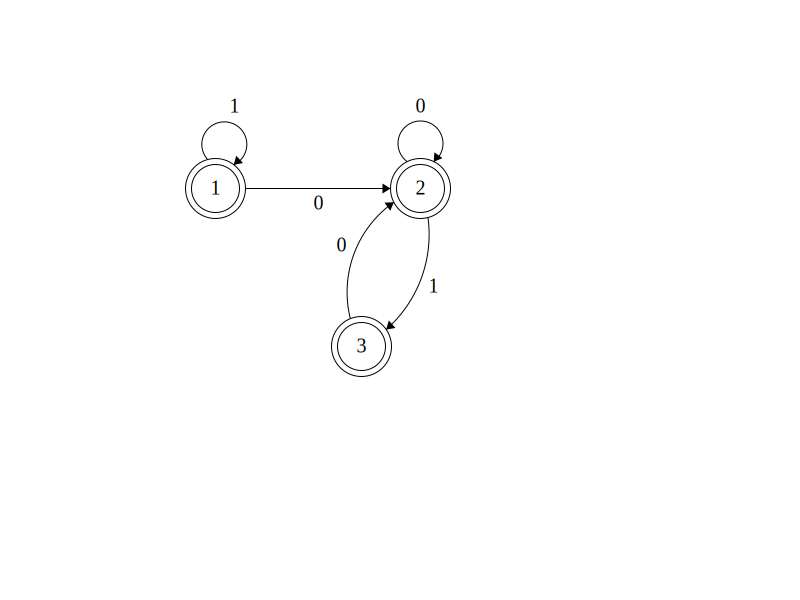
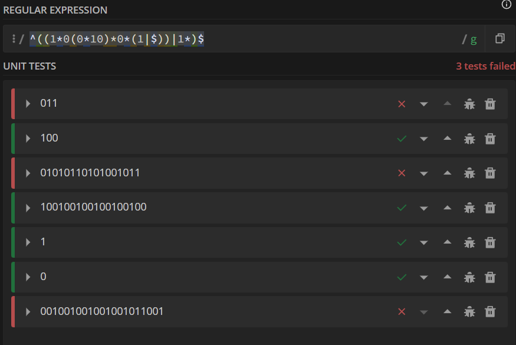

# PLC2025 - Processamento de Linguagens e Compiladores

## TPC1

**Problema:** Determinar uma expressão regular que aceite string binárias em que a substring "011" não seja fator na string

**Resposta no formato das aulas:** ^((1\*0(0\*10)\*0\*(1|\$))|1\*)\$

**Resolução:** Para determinar a expressão regular, recorri aos conhecimentos adequiridos na UC _Autómatos e Linguagens Formais_. Comecei por construir o autómato que reconhecia o problema. E para tal obti o seguinte autómato:

O autómato começa no estado 1, esqueci-me de colocar a seta.

A partir do qual, depois de o interpretar, consegui construir a expressão regular da linguagem.

**Expressão Regular** 
$1^* 0 (0^* 1 0)^* 0^* (1+ε) + 1^*$

**Resultado Experimental:** 
Usando a ferramenta _regular expressions 101_, realizei alguns testes para a minha expressão, e a expressão regular que determinei 
